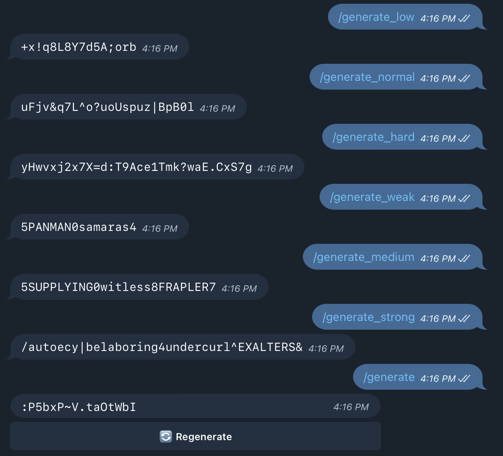
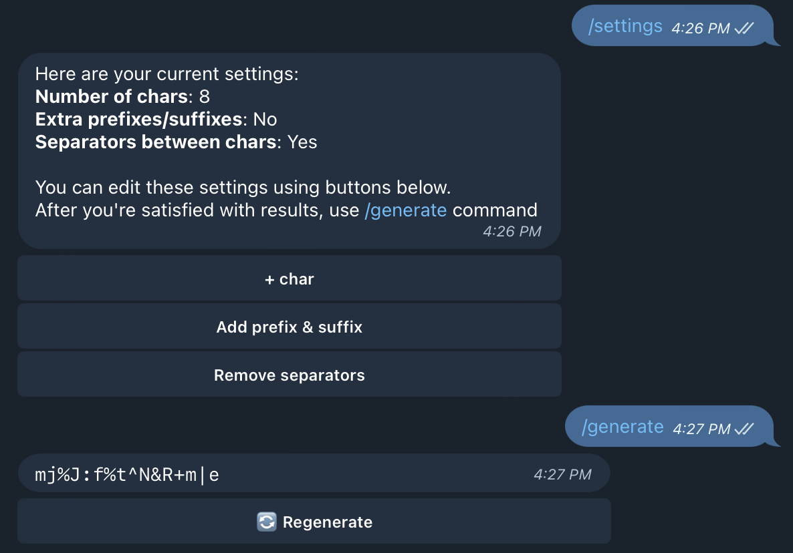
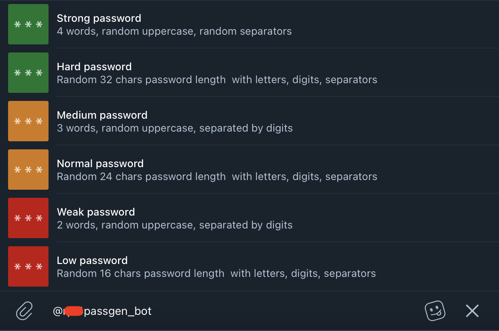

# Readable-Unreadable Passwords Generator for Telegram

This bot allows to generate readable and unreadable passwords directly from Telegram without necessity to open external utilities such as KeePass. An inspiration for this bot (readable passwords) came from famous [XKCD 936](http://xkcd.com/936/) strip.  

### Features 
* Presets of different complexity.
* Ability to generate customized password.
* Inline mode with colored complexity.
* No personal data is collected.
* Basic multilanguage support (EN+UA), depending on `language_code` from Bot API.

### Requirements
* Python 3.7+  
* [aiogram](https://github.com/aiogram/aiogram) – Telegram Bot API framework.
* [Redis](https://redis.io) as backend for aiogram's finite state machine (FSM).  
* [XKCD-password-generator](https://github.com/redacted/XKCD-password-generator) – Secure multiword passwords/passphrases, inspired by XKCD.

You can install all these requirements with `pip install -r requirements.txt` command. Redis must be done separately.

### Launch

* Clone the repository.
* Navigate (cd) to the cloned directory and install all dependencies from [requirements.txt](requirements.txt).
* Copy `config/.env-example` as `config/.env` (with a dot at the beginning), open it and fill in the variables.
* Run the bot: `python3 -m bot`.

### Systemd

* Follow steps 1-3 from the [Launch](#launch) section above.
* Copy passgen-bot.example.service to passgen-bot.service, open and edit the WorkingDirectory and ExecStart variables.
* Copy (or symlink) the service file to the /etc/systemd/system/ directory.
* Activate the service and start it: `sudo systemctl enable feedback-bot --now`.
* Check that the service has started: `systemctcl status feedback-bot`.

### Presets
 

* `/generate_low` – Random 16 chars password length  with letters, digits, separators.
* `/generate_normal` – Random 24 chars password length  with letters, digits, separators.
* `/generate_hard` – Random 32 chars password length  with letters, digits, separators.
* `/generate_weak` – 2 words, random uppercase, separated by digits.
* `/generate_medium` – 3 words, random uppercase, separated by digits.
* `/generate_strong` – 4 words, random uppercase, random separators.

### Customized Passwords

  

With `/settings` command you can customize generated passwords. Currently supported settings are number of chars (from 4 to 48), prefixes and suffices in the beginning and in the end of password and separators between chars in password. 
Then just use `/generate` command to create password based on your settings.

### Inline mode

You can also use this bot in inline mode. An indicator on the left shows rough password complexity (green is good, red is not).